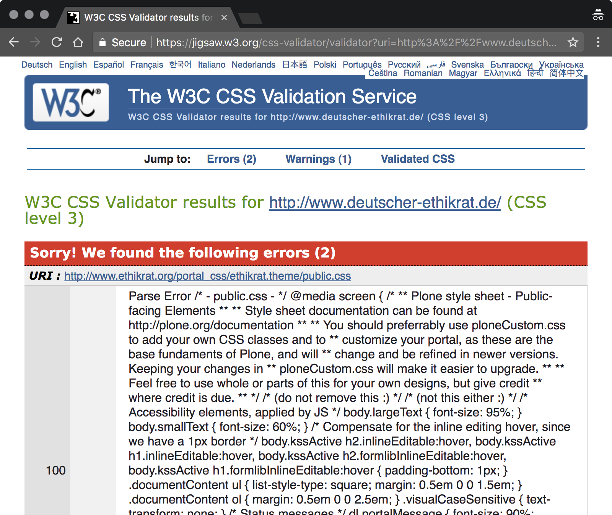

# Operational Optimization

In this first part of optimization, operational optimization, we’re going to talk about the options we have to write higher quality CSS while we’re right at them—in operation. (The second part will deal with options to optimize for production, that is, for release.)

Just as it didn’t seem useful to cover preprocessors so to get a clear look at CSS itself, we’re not going to discuss documentation, as with in-file comments, nor (most) guidelines that we can put in effect automatically. Documentation is an entirely different topic that has more to do with maintenance than with optimization, and coding guidelines, as important as they are and as many of them we can set up, are often a matter of preference that does not have a bearing on quality (also see: [_The Little Book of HTML/CSS Coding Guidelines_](http://www.oreilly.com/web-platform/free/little-book-html-css-coding-guidelines.csp)). We’re hence already applying two of our mantras: to keep it simple, and to automate.

## Understandability

In operation, we need to make sure our work is understandable. This does not only refer to multi-person environments in which we’re not alone working on a project; with consistency, for example, there’s at least individual consistency, which means to write code consistent with ourselves.

This understandability, as we just established for documentation and comments, can in parts be achieved automatically. But some pieces, and ironically we’ll right start with one (consistent declaration sorting), just from the go, are so important and useful to learn how to do manually, that we’ll still go over them. And so we’ll look at consistency and simplicity now as the two pillars for more understandable, for simplistically optimized CSS code.

### Consistency

Consistency in the case of code means to write and format things the same way every time. With individual or [“level 1” consistency](https://meiert.com/en/blog/consistency-levels/), this means to be consistent with how we ourselves write code. With collective consistency, we strive to stay consistent within the realm that we work in, as when we touch third party code and stick to their code style. And then there’s institutional or “level 3” consistency, referring to being consistent to coding standards put up by our organization.

Consistency is a _foundational_ part of optimization; it’s the first step of optimization. Without any sort of consistency, our optimization attempts are a lot harder.

```css
.feeds ul,
.posts ul ,
.events ul {
  list-style: none;
  margin: 0
}

.feeds li,
.posts li,
.events li {
  border-top: 1px solid #eeeeee;
  border-top: 1px solid rgba(238, 238, 238, 0.1);
  padding: 0.7667em 0;
}

.feeds li:first-child,
.posts li:first-child,
.events li:first-child {
  border-top: 0;
  padding-top: 0;
}

.feeds li:last-child,
.posts li:last-child,
.events li:last-child {
  padding-bottom: 0;
}

.authors > ul > li > a {
  margin-bottom: 1em;
  display: inline-block;
}

.authors ul {
  list-style: none;
  margin:0;
}

.authors li {
  padding: .7667em 0;
  border-top: 1px solid #eee;
  border-top: 1px solid rgba(238, 238, 238, 0.1);
}

.authors li:first-child {
   border-top: 0;
   padding-top: 0;
}

.authors li:last-child {
  padding-bottom: 0;
}

.contributors {
  color: #eee;
  border-top: 1px solid;
}

.contributors:first-child {
  border-top: none;
}
```

Example: Optimize this code by removing all the duplicates.

```css
.feeds ul,
.posts ul ,
.events ul {
  list-style: none;
  margin: 0;
}

.feeds li,
.posts li,
.events li {
  border-top: 1px solid #eeeeee;
  border-top: 1px solid rgba(238, 238, 238, 0.1);
  padding: .7667em 0;
}

.feeds li:first-child,
.posts li:first-child,
.events li:first-child {
  border-top: 0;
  padding-top: 0;
}

.feeds li:last-child,
.posts li:last-child,
.events li:last-child {
  padding-bottom: 0;
}

.authors > ul > li > a {
  display: inline-block;
  margin-bottom: 1em;
}

.authors ul {
  list-style: none;
  margin: 0;
}

.authors li {
  border-top: 1px solid #eee;
  border-top: 1px solid rgba(238, 238, 238, 0.1);
  padding: .7667em 0;
}

.authors li:first-child {
  border-top: 0;
  padding-top: 0;
}

.authors li:last-child {
  padding-bottom: 0;
}

.contributors {
  border-top: 1px solid #eee;
}

.contributors:first-child {
  border-top: 0;
}
```

Example: Now optimize this code.

Consistency is reasonably easy to achieve. We [establish coding guidelines](http://www.oreilly.com/web-platform/free/little-book-html-css-coding-guidelines.csp), we use (or build) tools to help follow and test for the guidelines, and then we enforce the guidelines. This goes as far as that many guidelines can be enforced right after writing and editing our CSS, and then again for production, where we may apply slightly different rules particularly geared towards production.

We’ll cover this last step in the chapter, “Production Optimization” and go over some tools under “Tools and Resources”—but we’ll spare ourselves from going over often subjective coding guidelines and how to automate their implementation and enforcement. What we’ll do is cover select aspects of consistency that are of particular import to CSS optimization. One is automatable; the other isn’t: declaration sorting and selector sorting.

#### Declaration Sorting

This is trivial and at the same time automatable: _Sort declarations alphabetically._ As Google advocates—disclaimer: I’ve worked on setting up respective guidelines—, the only exception are vendor-specific extensions (self-destructing declarations that start with hyphens) which are located right before respective declaration to complement.

```css
.example {
  background: none;
  border: 1em dotted #069;
  color: #096;
  display: block;
  float: none;
  font-size: 1em;
  font-style: italic;
  height: 100px;
  margin-top: 1em;
  max-width: calc(100vw - 10em);
  outline: 2em solid #609;
  overflow: auto;
  padding: 1em;
  position: relative;
  text-align: center;
  top: 1em;
  white-space: pre-wrap;
  width: 100%;
  z-index: 1;
  filter: blur(33.35px) sepia(0.34);
  -webkit-filter: blur(33.35px) sepia(0.34);
  -moz-filter: blur(33.35px) sepia(0.34);
}
```

Example: Quick, where do we add `transform: rotateY(10deg);` so that quick, someone else can immediately spot it?

This is trivial and automatable but still, in my eyes, one of the key optimization methods. That is so because an almost failsafe, easily repeatable, soon habitual, quickly communicable, and quite universal method to structure our code is something that has tremendous value. A simple and robust sorting scheme like the alphabetical ordering of declarations will at once make our code more understandable and help anyone touching it navigate in it.

I intentionally raise alphabetical sorting to “optimization status” because of its many benefits; our code will be better once we structure it, and we will write better code once we can do it ourselves, and not meed some processor to do that for us. (Not all CSS we’ll touch will have a script behind it that sorts for us, so we do benefit from engraining this way of sorting.)

[Sort declarations alphabetically.](https://meiert.com/en/blog/on-declaration-sorting/)

#### Selector Sorting

Selector sorting, then, is the antithesis to declaration sorting because it’s far less trivial to standardize (and on a complementary investigation it seems [the author’s own draft](https://meiert.com/en/blog/how-to-order-css-selectors/) is the only discoverable attempt for an order) and likewise difficult to automate.

Yet selector sorting is the next impactful method at our disposal to make our style sheets consistent and, in a way, “optimize them for further optimization.” When it comes to maintenance, for example, a defined and followed selector order is key to successfully DRYing up (from “Don’t Repeat Yourself,” to keep the cost of maintenance low) our style sheet declarations, because it’s what ever helps us to avoid an extra round of DRYing _selector groups_ and spares us from great additional testing complexity.

```css
html {
  font: 87.5%/1.5 'helvetica neue', helvetica, sans-serif;
  max-width: 600px;
  padding: 1em;
}

footer {
  border-top: 1px solid #eee;
  margin: 2.5em 0 0;
  padding: 3px 0 0;
}

h1 {
  font-weight: 300;
  margin: 0;
}

ul {
  list-style: none;
  margin-left: 0;
  padding-left: 0;
}

a {
  color: #e30613;
  text-decoration: none;
}

a:focus,
a:hover,
a:active {
  text-decoration: underline;
}

strong,
em {
  font-style: normal;
  font-weight: 600;
}

.info,
#intro,
#error {
  border-radius: 5px;
  padding: 5px;
}

.info {
  background: #fff3ca;
  margin: 1em -5px;
}
```

Example: High level block elements, at some point text level elements, then classes and IDs, [&c.](https://meiert.com/en/blog/how-to-order-css-selectors/)

Although it seems that many generations of web developers and teams of web developers have fared well without any firm idea of how to arrange selectors, only when we have some sense of order can we truly get to consistent style sheets (granted that this is our goal), and, more importantly, do we ever have a chance of eliminating possible extra work through haphazard by-chance ordering. As we’ll see with the avoidance of repetition, that extra work is otherwise actually awaiting us.

Accordingly, the lack of a consensus on selector sorting, and particularly the lack of _options_ for selector orders should give us much to think, and something important to work on community-wise. Consider what we do have and help us come up with additional options and, perhaps, standards.

### Simplicity

Making code simpler is our next optimization goal. Alas, that goal of code simplicity is often the goal of code minimalism, and simplicity and minimalism don’t necessarily correlate—they don’t correlate in our coming case of shorthands, indeed not, but they do when we speak about character minimization as part of production optimization.

And yet, the goal of simplicity, just seen as one, is important: Optimizing for simplicity appears to make code more understandable and our work easier, and it seems to challenge ourselves as craftsmen to only use the least amount of code possible.

#### ID and Class Naming

In the times of a still surprisingly alive OOCSS, or BEM, or Atomic CSS ID and class naming has drowned as a developer topic, sinking to a second order afterthought seemingly not worth attention. And yet when we consider that not all web projects are super-complex mega sites with internationally distributed teams of dozens of developers and third party agencies in mostly automated testing and deployment environments so to warrant presentational naming schemes because our guideline and communication processes are so difficult to implement that no hand knows what the other hand does, we don’t need nor at all benefit from naming schemes that sacrifice all understandability and maintainability for brief presentational class soup equivalent to the 90’s (Atomic CSS), and we notice that the times of knowing how to name IDs and classes, and to actually use the _two_ (and not, as has been attempted with universal selectors, `!important`, or—to be covered, too—shorthands, shun IDs), are not over yet.

The [rules for ID and class naming](https://meiert.com/en/blog/best-practice-ids-and-classes/) are simple and lasting:

* keep use of IDs and classes to a minimum;
* if needed, use functional ID and class names;
* otherwise use generic ID and class names; and
* use names that are as short as possible but as long as necessary.

This doesn’t aim to rule out other naming schemes, but it’s the starting point for every web developer. It’s useful to learn and apply these rules first before switching to a scheme that violates them, because only when we have the experience of developing and maintaining web projects will be able to tell whether the violation is smart and justified, or haphazard and barely thought-out.

The topic of ID and class naming is really a beginner topic but it’s being neglected these days, and I wanted to gloss over that because an otherwise optimized style sheet that uses poor ID and class names is still a poor, that is, poorly crafted style sheet.

#### Shorthands

Shorthands—CSS declarations that combine other declarations, like `font`, `border`, and `animation`—are a very useful part of CSS because they help to make CSS more minimal-simple. They allow us to write less code though not necessarily more understandable code—a situation that perhaps made one camp declare that [CSS shorthands were an anti-pattern](https://csswizardry.com/2016/12/css-shorthand-syntax-considered-an-anti-pattern/), and the other say [they weren’t](https://meiert.com/en/blog/css-shorthands/).

Modifying what I put to protocol as a part of that other camp, they’re both.

Shorthands make code less understandable in complex projects, but make code more minimal. What tips the simplicity scale in my eyes is the fact that shorthands _always_ make our CSS more minimally simple, whereas _only in large and complex projects_, they make it less understandably simple because they imply too much: Everything a shorthand declaration doesn’t say still says something, because the values that are not set are really set to their initial values. And that can—in larger projects—lead to problems.

```css
html {
  background: #fff;
  font: 100%/1.88 palatino, lora, georgia, cambria, serif;
}

body {
  margin: auto;
  padding: 1.25em 1em;
}

#announcement {
  background: #ff0;
  margin: 1em auto 1.5em;
  padding: .5em;
}
```

Example: In this shorthands-only piece from an [actual website](https://mirrors.meiert.org/coderesponsibly.org/), the shorthands only help.

For their value in making code more compact, their positive effect on small projects, and the few tools to automate shorthands, we benefit from using shorthands in our code, and with that optimizing it.

## Performance

Performance is one of the most obvious goals to optimize for. The faster, the better, because we know that the [user experience improves the faster everyone gets what they want](https://www.nngroup.com/articles/website-response-times/), and that [with more speed, conversions increase as well](https://blog.kissmetrics.com/speed-is-a-killer/).

And yet what we can roughly say is that improving rendering performance is not nearly as effective and important as is improving loading performance. That is, not omitting optional tags for the reason that the browser would otherwise need to “put them back” is not nearly as helpful for performance than compressing images. These calculations are generally done so quickly that respective issues don’t matter (even though personally, as I do when coding without optional tags and without unneeded quotes around attribute values, we may go beyond such non-needs).

The cases that we’ll look at now, still in our section on “operational” optimization, will exemplify a bit of this situation. Performance is not nearly as clear cut as it’s sometimes presented.

### Irrelevant: Selector Performance

Selector performance is _not_ something to optimize for. Selector performance is irrelevant. The price we pay for optimizing for selector performance is, indeed, terrible: We micro-manage our work for gains that aren’t even noticeable.

In 2009, Steve Souders contributed perhaps the first important results to the topic, and [one of his main articles](http://www.stevesouders.com/blog/2009/03/10/performance-impact-of-css-selectors/) on the subject should have made more of us think. First, in his tests, even style sheets with 18,000 rules (!) were rendered within 600 ms (!). Then, Steve explained in quite clear terms, his hypothesis: “For most web sites, the possible performance gains from optimizing CSS selectors will be small, and are not worth the costs.”

Perhaps people misunderstood when Steve went on to write, “There are some types of CSS rules and interactions with JavaScript that can make a page noticeably slower. This is where the focus should be.”—What we saw, namely, was an [undue focus](https://meiert.com/en/blog/performance-of-css-selectors/) on selector performance and an outright childish ban of selectors, notably the universal selector.

(Years later, in additional investigations, we even find problems with the methodology leading to important observations like this, [one by Ben Frain](https://benfrain.com/css-performance-revisited-selectors-bloat-expensive-styles/): “It is practically impossible to predict the final performance impact of a given selector by just examining the selectors.”)

The first problem with optimizing for selectors is that the gains are negligible. Yes, some selectors are slower than others, and from the way they work this is probably going to be the case until the world ends. Alas, nothing practically relevant follows from this observation: The effects are not felt by us nor by our end users. We do not ship websites that use 25,000 rules of the type of `:after` (and that’s it) to bring pages to a crawl; a) they don’t come to a crawl, b) who writes code like that has others issues.

The second problem with optimizing for selectors is that we over-optimize and micro-manage, and actually slow down our workflow and write worse CSS. Putting up rules in place for how _selectors_ should look like is adding a cognitive restriction that only hinders a team of developers, and the outcome is not any more elegant code in terms of minimalism (though those of us who connect verbosity with understandability may have a point).

Where we are right now, selector performance is still a box better left closed.

### Irrelevant: Inline CSS

Similarly, though practically speaking much more legitimate, inline CSS—applying CSS directly through `style` attributes—should also be avoided. This recommendation comes again from the idea to keep [the big picture](https://meiert.com/en/blog/big-picture-thinking/) in mind, by acknowledging that yes, inline CSS is often useful for performance reasons (saving one or more style sheet HTTP requests, applying faster selectors), but no, it violates separation of concerns and makes maintenance harder. Too hard.

It is important to me to drive this point home, and to risk making this book a lot more complicated and seemingly less useful: We are of no good use as web developers when we are blind to the consequences of our work. An accessibility expert, a JavaScript expert, a performance expert are all still rather poor web developers if they don’t understand _and factor in_ what their expert knowledge means for other areas of our field.

```html
<div style="display:none" jsl="$t t-aTz9-_sUcEc;$x 0;" class="r-ild1JbEZKhjg"></div><div id="duf3-46" data-jiis="up" data-async-type="duffy3" data-async-context-required="type,open,feature_id,async_id,entry_point,authority,card_id,header,suggestions,surface,suggestions_types,suggestions_subtypes" class="y yp"></div><a class="duf3 _sWr" href="#" id="sbfblt" data-async-trigger="duf3-46" jsaction="async.u">Report foo</a></div></form></div><div class="sfbgx"></div><div id="gac_scont"></div><div class="spch s2fp-h" style="display:none" id="spch"><div class="spchc" id="spchc"><div class="_o3"><div class="_AM"><span class="_CMb" id="spchl"></span><span class="button" id="spchb"><div class="_wPb"><span class="_AUb"></span><div class="_Fjd"><span class="_oXb"></span><span class="_dWb"></span></div></div></span></div><div class="_gjb"><span class="spcht" id="spchi" style="color:#777"></span><span class="spcht" id="spchf" style="color:#000"></span></div><div class="foo-logo"></div></div><div class="_ypc"><div class="_zpc"></div></div></div><div class="close-button" id="spchx">&times;</div></div><div style="display:none" jsl="$t t-orNZyHXTT74;$x 0;" class="r-iCneKvRyCT78"></div><div class="content" id="main"><span class="ctr-p" id="body"><center><div style="height:233px;margin-top:89px" id="lga"><div style="padding-top:109px"><style>#hplogo{background:url(/images/branding/foologo/2x/foologo_color_272x92dp.png) no-repeat}@media (-webkit-max-device-pixel-ratio:1),(max-resolution:96dpi){#hplogo{background:url(/images/branding/foologo/1x/foologo_color_272x92dp.png) no-repeat}}</style><div style="background-size:272px 92px;height:92px;width:272px" title="foo" align="left" id="hplogo" onload="window.lol&&lol()">
```

Example: Can these styles lie? (They can.)

As such, yes, inline CSS is good for performance, and as such we should consider it a CSS optimization measure. But then, categorical no—unless, perhaps, we deal with truly unique styling on ever unique single pages—to use inline CSS. Our vision of web development, to write the leanest possible HTML for maximum freedom of movement in terms of updates and maintenance, forbids this. We don’t want to touch HTML for CSS updates—and clearly, inline CSS prevents that.

_⚐ Note_

With improvements to our content management, build, and deployment processes, HTML maintenance has become a lot easier and cheaper. We’ve gotten to a point where we can speak of [a new paradigm](https://meiert.com/en/blog/two-paradigms/) for web development, where the first paradigm, absolute separation of concerns, has become weaker. That is development-practically speaking a helpful and development-theoretically speaking a fascinating development. For the time being I still recommend to follow the first paradigm and separate concerns (like structure, presentation, behavior)—and to always [keep the big picture in mind](https://meiert.com/en/blog/big-picture-thinking/).

### Possibly Relevant: Declaration Prudence

For declarations we face a similar situation as with selectors in that avoiding some of them seems to cause more harm and be more cognitively demanding than not to do anything (or continue doing what we used to do).

With declarations, we are reasonably certain that declarations like `box-shadow`, `filter`, `opacity`, and `transform`, and some particular values, are _significantly_ slower and hence more expensive than others. So much more expensive, indeed, that the effects can be perceivable even with few declarations, hence making this a much more important point on our optimization agenda than selectors.

However, the problem is that data are hard to come by. Ben Frain has contributed some [data on selector and declaration performance](https://benfrain.com/css-performance-revisited-selectors-bloat-expensive-styles/), and [so has “kangax,”](http://perfectionkills.com/profiling-css-for-fun-and-profit-optimization-notes/) alas the data are not robust enough or not available anymore (I have not reached kangax).

Until we do more research and can properly, reliably document all the declarations that are particularly slow, or any value ranges that are particularly, we are in a dilemma, however, because there’s no point in panicking now, and no point in blindly guessing what declarations should be avoided.

There may not even be a point taking action at all, because at the end of the day, we will still need to look at the case in question: How important is respective styling, and if it is important, what’s the performance impact of its replacement? In this case, then, it seems advisable to me to flag declarations as a possible optimization source, but not make it a priority—until we have better data.

### Rule Hygiene

Where we can finally start optimizing for performance is with always removing anything in our CSS that isn’t needed anymore: rule hygiene. This sort of hygiene is simple in theory—just get rid of what’s not needed—but tricky in practice.

The trickiness consists in the fact that it’s hard to impossible to tell what rules truly aren’t needed. There are tools for this purpose, but it’s difficult to be certain of where style sheets are needed—and impossible on really large websites that also have similarly looking partner sites where third parties may hot-link main style sheets—, and difficult to automate the procedure.

Generally speaking though, what helps this hygiene is the following:

* Discipline to remove page elements
* Diligence to immediately clean style sheets
* Section and general code comments
* Descriptive, at least direct selectors (`footer` instead of `body > :last-child`)
* Tools
  - [Chrome Developer Tools](https://developer.chrome.com/devtools) browser extension audit tab
  - [Dust-Me Selectors](https://addons.mozilla.org/en-US/firefox/addon/dust-me-selectors/) Firefox browser extension
  - [Unused CSS](https://unused-css.com/) crawler
  - [PurifyCSS](https://github.com/purifycss/purifycss) script
  - UnCSS [script](https://github.com/giakki/uncss) and [online tool](https://uncss-online.com/)

The Unused CSS crawler goes furthest where we actually want to go, to have something that tells us with considerable certainty what is used and what’s not. It has become one of my favorite tools for CSS optimization through rule hygiene.

_⚐ Note_

Images have always been a matter of optimization on the Web. At first they hadn’t been recognized as something to optimize for and rather served the systemic _deterioration_ of websites, by being used endlessly to build entire layouts, then layout tables (though in a way, they only served optimization of said layouts). But then our attention was on

* what formats to use for quality and compression (“GIF or JPG?”)
* how to compress images
* how to limit the number of images (to limit the number of HTTP requests)
* how to not use images (data URIs)
* and again, what formats to use (“…or SVG?”)

These topics, without the redundancy of the formats and compression questions, are exactly the ones we should still focus on today. But although I’ve debated to make image optimization a part of this book, it’s not _CSS_ optimization. It’s image optimization. (And also, Addy Osmani has just written [such a book](https://images.guide/).)

## Quality

On the surface optimization seems to have an obvious goal of increasing quality, but, and my own knowledge of the philosophy of language leaves me here, optimization seems to have value just as a process, on its own. One can optimize something, for something, and something can have a quality of something, but not of something else.

Generall speaking, we cover the general optimization and the general quality of CSS; all that we’ve established about big picture thinking supports this notion. And yet quality should be called out explicitly, as our general goal. And for that goal, there’s one particular aspect to pay attention to.

### Validation

How can we tell that what we’re coding works? We test. How can we tell it’s error-free? We validate. Yes, in a way testing exposes errors in our code, and on the other end we depend on validators to be up-to-date on the latest and greatest. And still, validation is a crucial part in making sure that our code is syntactically correct and uses selectors and declarations (CSS) as well as a structure and elements and attributes (HTML) that actually exist.

There is a gray area when respective working groups just came up with new things (that is, just extended the specifications), and the validator teams couldn’t catch up yet, but that gray area must not prevent us from validating. That would be like only using mobiles whose batteries are fully charged, or only wearing what had just been laundered.



Example: [Issues.](https://jigsaw.w3.org/css-validator/validator?uri=http%3A%2F%2Fwww.deutscher-ethikrat.de%2F&profile=css3&usermedium=all&warning=1&vextwarning=&lang=en)

Through validation—whether using the [W3C CSS validator](https://jigsaw.w3.org/css-validator/) or [some other tool](https://uitest.com/en/analysis/#validation)—we optimize our style sheets because we can correct and remove code that doesn’t work. We also benefit through, and I’ve once called these the actually [two great things](https://meiert.com/en/blog/about-validation/) about validating, getting a better technical understanding (validation issues can be quite informative and instructive) and becoming better professionals (everyone can write poor and invalid code—we’re experts because we can and we do write valid code).

@@