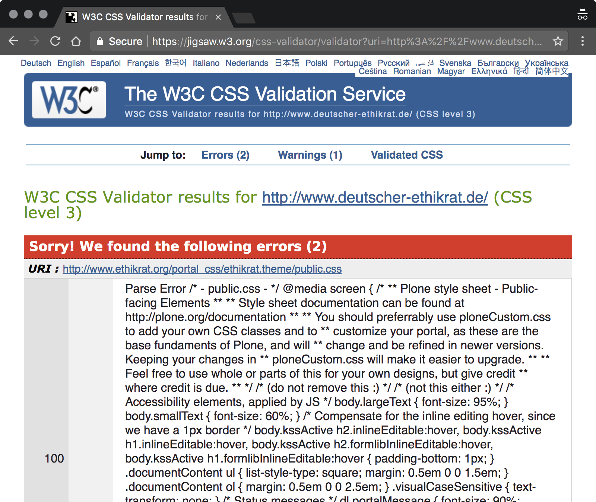

# Operational Optimization

In this section, we’re going to talk about our options for writing higher quality CSS while we’re right at it, in operation. This type of optimization benefits us as developers. (The next section will deal with options to optimize for production, that is, for release and live use, and for the good of our users.)

To get a better look at CSS itself, it didn’t seem useful to cover preprocessors. For the same reason we’re not going to discuss documentation or guidelines, either, like code comments or formatting standards. Documentation is an entirely different topic that has more to do with maintenance than with optimization. Coding guidelines, as important as they are and as many of them we can set up, are often a matter of preference and don’t necessarily have a bearing on quality (instead see: [_The Little Book of HTML/CSS Coding Guidelines_](https://www.oreilly.com/library/view/the-little-book/9781492048459/)). We’re already applying one of the mantras: keeping it simple.

## Understandability

In operation, we need to make sure our work is understandable. This does not only refer to multi-person environments in which we’re not alone working on a project. With consistency, for example, there’s at least individual consistency, which means to write code consistent with ourselves.

Understandability can, in part, be achieved through documentation and comments. Yet other aspects, and we’ll right start with one (consistent declaration sorting), are so important to take care of that we’ll need to go over them in detail. Consistency and simplicity, the next two sections, make for the two pillars for more understandable, because simplistically optimized, CSS code.

### Consistency

Consistency in the case of code means to write and format things the same way every time. With individual or [“level 1” consistency](https://meiert.com/en/blog/consistency-levels/), this means to be consistent with how we ourselves write code. With collective and “level 2” consistency, we strive to stay consistent within the realm that we work in, as when we touch third-party code and stick to their code style. And then there’s institutional or “level 3” consistency—being consistent with coding standards put up by our organization.

Consistency is a _foundational_ part of optimization; it’s the first step of optimization. Without any sort of consistency, any other optimization work can be a lot harder.

```css
.feeds ul,
.posts ul ,
.events ul {
  list-style: none;
  margin: 0
}

.feeds li,
.posts li,
.events li {
  border-top: 1px solid #eeeeee;
  padding: 0.7667em 0;
}

.feeds li:first-child,
.posts li:first-child,
.events li:first-child {
  border-top: 0;
  padding-top: 0;
}

.feeds li:last-child,
.posts li:last-child,
.events li:last-child {
  padding-bottom: 0;
}

.authors > ul > li > a {
  margin-bottom: 1em;
  display: inline-block;
}

.authors ul {
  list-style: none;
  margin:0;
}

.authors li {
  padding: .7667em 0;
  border-top: 1px solid #eee;
}

.authors li:first-child {
   border-top: 0;
   padding-top: 0;
}

.authors li:last-child {
  padding-bottom: 0;
}
```

C> _Example: Random sample code._

```css
.feeds ul,
.posts ul ,
.events ul,
.authors ul {
  list-style: none;
  margin: 0;
}

.feeds li,
.posts li,
.events li,
.authors li {
  border-top: 1px solid #eee;
  padding: .77em 0;
}

.feeds li:first-child,
.posts li:first-child,
.events li:first-child,
.authors li:first-child {
  border-top: 0;
  padding-top: 0;
}

.feeds li:last-child,
.posts li:last-child,
.events li:last-child,
.authors li:last-child {
  padding-bottom: 0;
}

.authors > ul > li > a {
  display: inline-block;
  margin-bottom: 1em;
}
```

C> _Example: Adjusted (note the order of declarations and selectors). Since the writing of this book, [the `:is()` pseudo-class](https://css-tricks.com/almanac/selectors/i/is/) emerged as a great option to simplify code like this._

Consistency is reasonably easy to achieve. We [establish coding guidelines](https://www.oreilly.com/library/view/the-little-book/9781492048459/), we use (or build) tools to help follow and test for the guidelines, and then we enforce the guidelines. This goes as far as that many guidelines can be enforced right after writing and editing our CSS, and then again for production, where we may apply slightly different rules particularly geared towards production.

We’ll cover this last step in the chapter “Production Optimization” and go over some tools under “Tools and Resources.” We skip going over often subjective coding guidelines and how to automate their implementation and enforcement. What’s more useful is to cover select aspects of consistency that are of particular import to CSS optimization. One is automatable; the other isn’t: declaration sorting and selector sorting.

#### Declaration Sorting

This is trivial and at the same time automatable: _Sort declarations alphabetically._ As Google advocates—disclosure: I had been driving the last major initiative around Google’s HTML and CSS guidelines—, the only exception are vendor-specific extensions (self-destructing declarations that start with hyphens) which are to be located right before the respective main declaration.

```css
.example {
  background: none;
  border: 1em dotted #069;
  color: #096;
  display: block;
  -moz-filter: blur(33.35px) sepia(0.34);
  -webkit-filter: blur(33.35px) sepia(0.34);
  filter: blur(33.35px) sepia(0.34);
  float: none;
  font-size: 1em;
  font-style: italic;
  height: 100px;
  margin-top: 1em;
  max-width: calc(100vw - 10em);
  outline: 2em solid #609;
  overflow: auto;
  padding: 1em;
  position: relative;
  text-align: center;
  top: 1em;
  white-space: pre-wrap;
  width: 100%;
  z-index: 1;
}
```

C> _Example: Where to add `transform: rotateY(10deg);` so that everyone can find it quickly?_

This is trivial and automatable but still, in my eyes, one of the key optimization methods. That’s because an almost failsafe, easily repeatable, soon habitual, quickly communicable, and quite universal method to structure our code is something that has tremendous value. A simple and robust sorting scheme like the alphabetical ordering of declarations does at once make our code more understandable and help anyone touching it navigate it.

I intentionally raise alphabetical sorting to “optimization status” because of its many benefits; our code will be better once we structure it, and we’ll write better code once we can do it ourselves and not require some processor to do that for us. (Not all CSS we’ll touch will have a script behind it that sorts for us, so we strongly benefit from internalizing this way of sorting.)

Sort declarations [alphabetically](https://meiert.com/en/blog/on-declaration-sorting/).

#### Selector Sorting

Selector sorting, then, is the antithesis to declaration sorting because it’s far less trivial to standardize and also more difficult to automate. (On a complementary investigation it seems [my own draft](https://meiert.com/en/blog/how-to-order-css-selectors/) is the only public attempt for an order.)

Yet selector sorting is the next impactful method at our disposal to make our style sheets consistent and, in a way, “optimize them for further optimization.” When it comes to maintenance, a defined and followed selector order is crucial to successfully DRYing up—“DRY” from “Don’t Repeat Yourself,” a principle that helps with maintenance—our style sheet declarations, because it makes us avoid an extra round of DRYing _selector groups_ and spares from great additional testing complexity.

```css
html {
  font: 87.5%/1.5 'helvetica neue', helvetica, sans-serif;
  max-width: 600px;
  padding: 1em;
}

footer {
  border-top: 1px solid #eee;
  margin: 2.5em 0 0;
  padding: 3px 0 0;
}

h1 {
  font-weight: 300;
  margin: 0;
}

ul {
  list-style: none;
  margin-left: 0;
  padding-left: 0;
}

a {
  color: #e30613;
  text-decoration: none;
}

a:focus,
a:hover,
a:active {
  text-decoration: underline;
}

strong,
em {
  font-style: normal;
  font-weight: 600;
}

.info,
#intro,
#error {
  border-radius: 5px;
  padding: 5px;
}

.info {
  background: #fff3ca;
  margin: 1em -5px;
}
```

C> _Example: High level block elements, then text level elements, then classes and IDs, [&c.](https://meiert.com/en/blog/how-to-order-css-selectors/)_

Although it seems that many teams of web developers have survived without a firm idea of how to arrange selectors, only when we have some sense of order can we truly get to consistent style sheets (granted that this is our goal), and, more importantly, do we ever have a chance of eliminating extra work through haphazard by-chance ordering. As we’ll see with the avoidance of repetition, that extra work is otherwise awaiting us.

Accordingly, the lack of initiatives and options for selector orders should give us much to think and something important to work on community-wise. If you’re in a position to do so, consider what we do have and help us come up with additional options and, perhaps, a standard.

### Simplicity

Making code simpler is the next optimization goal. However, the goal of code simplicity is often also a goal of code minimalism, and simplicity and minimalism don’t necessarily correlate—they don’t correlate in our coming case of shorthands, indeed not, though they do when we speak about character minimization as part of production optimization.

The goal of simplicity is important: Optimizing for it makes code more understandable and, in most cases, faster. It makes our work easier. And it probably generally makes our work better, because using simple and little code challenges ourselves as craftspeople.

#### ID and Class Naming

In times of a still surprisingly alive OOCSS and BEM and Atomic CSS, ID and class naming has drowned as a developer topic, sinking to a second-order afterthought. And yet when we consider that not all web projects are super-complex mega sites with internationally distributed teams of dozens of developers and third-party agencies in automated testing and deployment environments so to warrant presentational naming schemes because our guideline and communication processes are so difficult to implement that no hand knows what the other hand is doing—short pause—, we don’t need or benefit from naming schemes that sacrifice understandability and maintainability for brief presentational class soups from the 90’s (Atomic CSS). The time to know how to name IDs and classes, and to actually use _both_ aren’t over yet; IDs aren’t blindly to be shunned, just as little as universal selectors, `!important`, and shorthands.

The [rules for ID and class naming](https://meiert.com/en/blog/best-practice-ids-and-classes/) are simple and lasting:

* keep use of IDs and classes to a _minimum_;
* if needed, use _functional_ ID and class names;
* otherwise use _generic_ ID and class names; and
* use names that are _as short as possible but as long as necessary_.

This doesn’t aim to rule out other naming schemes, but should be the starting point for every web developer. It’s useful to learn and apply these rules first before switching to a scheme that violates them, because only when we have the experience of developing and maintaining web projects will we be able to tell whether the violation is smart and justified, or haphazard and premature.

Because the topic of ID and class naming, although a beginner topic, has been so neglected, it’s important to note: No matter how otherwise optimized, a style sheet that uses poor ID and class names is still a poor, that is, a poorly crafted style sheet.

#### Shorthands

Shorthands—CSS declarations that combine other declarations, like `font`, `border`, or `animation`—are a very useful part of CSS because they help to make CSS more minimal-simple. They allow us to write less code though not necessarily more understandable code—a situation that perhaps made one camp declare that [CSS shorthands were an anti-pattern](https://csswizardry.com/2016/12/css-shorthand-syntax-considered-an-anti-pattern/), and the other say [they weren’t](https://meiert.com/en/blog/css-shorthands/).

Modifying what I put to protocol as a part of that other camp, they’re both.

Shorthands make code less understandable in complex projects, but make code more minimal. What tips the simplicity scale in my mind is the fact that shorthands _always_ make our CSS more minimally simple, whereas _only in large and complex projects_, they make it less understandably simple because they imply so much: Everything a shorthand declaration _doesn’t_ say still means something, because the values that aren’t set are really set to their initial values. And that can—in larger projects—lead to problems.

```css
html {
  background: #fff;
  font: 100%/1.88 palatino, lora, georgia, cambria, serif;
}

body {
  margin: auto;
  padding: 1.25em 1em;
}

#announcement {
  background: #ff0;
  margin: 1em auto 1.5em;
  padding: .5em;
}
```

C> _Example: In this shorthands-only piece from an [actual website](https://mirrors.meiert.org/coderesponsibly.org/), the shorthands simplify and improve the code._

Because of their value in making code more compact, and their generally positive effects on small projects, we benefit from using shorthands.

## Performance

Performance is one of the most obvious goals to optimize for. The faster, the better, because we know that the [user experience improves the faster everyone gets what they want](https://www.nngroup.com/articles/website-response-times/), and that [with more speed, conversions increase as well](https://blog.kissmetrics.com/speed-is-a-killer/).

And yet what we can roughly say is that improving rendering performance is not nearly as effective and important as is improving loading performance. That is, not omitting optional tags for the reason that the browser would otherwise need to “put them back” is not as helpful for performance as is compressing images. These calculations are generally done so quickly that the respective issues don’t matter in practice. (Accordingly, there’s nothing to worry about when [omitting optional tags and unneeded quotes](https://meiert.com/en/blog/optional-html/) around attribute values.)

The cases we’ll look at now, still in our section on “operational” optimization, will exemplify a bit of this situation. Performance is not nearly as clear cut as it’s sometimes presented.

### Irrelevant: Selector Performance

Selector performance is _not_ something to optimize for. Selector performance is irrelevant. The price we pay for optimizing for selector performance is terrible: We micromanage our work for gains that aren’t noticeable.

In 2009, Steve Souders contributed perhaps the first insights into the topic, and [one of his main articles](https://www.stevesouders.com/blog/2009/03/10/performance-impact-of-css-selectors/) on the subject should have made more of us think. First, in his tests, even style sheets with _18,000_ rules were rendered within _600&nbsp;ms_. Then, Steve explained in quite clear terms, his hypothesis: “For most web sites, the possible performance gains from optimizing CSS selectors will be small, and are not worth the costs.”

Perhaps people misunderstood when Steve went on to write, “There are some types of CSS rules and interactions with JavaScript that can make a page noticeably slower. This is where the focus should be.”—What we saw, namely, was an [undue focus](https://meiert.com/en/blog/performance-of-css-selectors/) on selector performance and an outright childish ban of selectors, notably the universal selector.

(Years later, in additional investigations, we find problems with the methodology, leading to important observations like this one, [by Ben Frain](https://benfrain.com/css-performance-revisited-selectors-bloat-expensive-styles/): “It is practically impossible to predict the final performance impact of a given selector by just examining the selectors.”)

The first problem with optimizing for selectors is that the gains are negligible. Yes, some selectors are slower than others, and from the way they work this is probably going to be the case until the world ends. Alas, nothing practically relevant follows from this observation: The effects are not felt by us nor by our users. We do not ship websites that use 25,000 rules of the type of `::after` (and nothing else) to bring pages to a crawl; a) they don’t come to a crawl, b) who writes code like that has other issues.

The second problem with optimizing for selectors is that we over-optimize and micromanage, and actually slow down our workflow writing _worse_ CSS. Putting up rules in place for how _selectors_ should look like is adding a restriction that only hinders a team of developers, and the outcome is not any more elegant code in terms of code minimalism (though those who connect verbosity with understandability may have a point).

Where we are right now, selector performance is still a box better left closed.

### Irrelevant: Inline CSS

Similarly, though practically speaking much more legitimate, inline CSS—applying CSS directly through `style` attributes—should also be avoided. This recommendation comes again from the idea of keeping [the big picture](https://meiert.com/en/blog/big-picture-thinking/) in mind, by acknowledging that yes, inline CSS can be useful for performance reasons (saving one or more style sheet HTTP requests, applying faster selectors), but no, it violates separation of concerns and makes maintenance harder. Too hard.

It’s important to drive a point home: We are of no good use as web developers when we are blind to the consequences of our work. An accessibility expert, a JavaScript expert, a performance expert are all still rather poor web developers if they don’t understand and consider how their expert knowledge impacts other areas of the field.

```html
<div style="display:none" jsl="$t t-aTz9-_sUcEc;$x 0;" class="r-ild1JbEZKhjg"></div><div id="duf3-46" data-jiis="up" data-async-type="duffy3" data-async-context-required="type,open,feature_id,async_id,entry_point,authority,card_id,header,suggestions,surface,suggestions_types,suggestions_subtypes" class="y yp"></div><a class="duf3 _sWr" href="#" id="sbfblt" data-async-trigger="duf3-46" jsaction="async.u">Report foo</a></div></form></div><div class="sfbgx"></div><div id="gac_scont"></div><div class="spch s2fp-h" style="display:none" id="spch"><div class="spchc" id="spchc"><div class="_o3"><div class="_AM"><span class="_CMb" id="spchl"></span><span class="button" id="spchb"><div class="_wPb"><span class="_AUb"></span><div class="_Fjd"><span class="_oXb"></span><span class="_dWb"></span></div></div></span></div><div class="_gjb"><span class="spcht" id="spchi" style="color:#777"></span><span class="spcht" id="spchf" style="color:#000"></span></div><div class="foo-logo"></div></div><div class="_ypc"><div class="_zpc"></div></div></div><div class="close-button" id="spchx">&times;</div></div><div style="display:none" jsl="$t t-orNZyHXTT74;$x 0;" class="r-iCneKvRyCT78"></div><div class="content" id="main"><span class="ctr-p" id="body"><center><div style="height:233px;margin-top:89px" id="lga"><div style="padding-top:109px"><style>#hplogo{background:url(/images/branding/foologo/2x/foologo_color_272x92dp.png) no-repeat}@media (-webkit-max-device-pixel-ratio:1),(max-resolution:96dpi){#hplogo{background:url(/images/branding/foologo/1x/foologo_color_272x92dp.png) no-repeat}}</style><div style="background-size:272px 92px;height:92px;width:272px" title="foo" align="left" id="hplogo" onload="window.lol&&lol()">
```

C> _Example: Can these styles lie?_

As such, yes, inline CSS is good for performance, and as such we should consider it a CSS optimization measure. But unless we deal with truly unique styling on truly unique single pages, a categorical _“no”_ to inline CSS. Our vision of web development, to write the leanest possible HTML for maximum freedom of movement in terms of updates and maintenance, discourages this. We don’t want to touch HTML for formatting updates—and inline CSS prevents that.

I> With improvements to our content management, build, and deployment processes, HTML maintenance has become a lot easier and cheaper. And not just with component-based development have we gotten to a point at which we can speak of [a new paradigm](https://meiert.com/en/blog/two-paradigms/) for web development, where the first paradigm, absolute separation of concerns, has been softened decisively. That’s development-practically speaking a helpful and development-theoretically speaking a fascinating development. Personally, I still recommend to follow the first paradigm and to separate concerns (like structure, presentation, and behavior).

### Possibly Relevant: Declaration Prudence

For declarations we face a similar situation as with selectors in that avoiding certain declarations appears to be more counter-productive than not doing anything.

We know that declarations like `box-shadow`, `filter`, `opacity`, and `transform`, as well as a few special values, are significantly slower and hence more expensive than others. They’re so much more expensive that the effects can be perceivable even with few declarations, hence making this a much more important point on our optimization agenda than selectors.

However, the problem is that data are hard to come by. Ben Frain has contributed some [data on selector and declaration performance](https://benfrain.com/css-performance-revisited-selectors-bloat-expensive-styles/), and [so has Juriy Zaytsev](http://perfectionkills.com/profiling-css-for-fun-and-profit-optimization-notes/), alas the data are not robust or not even available anymore (I couldn’t reach Juriy for clarification).

Until we do more research and can properly, reliably document all the declarations and value ranges that are particularly slow, there’s no point in panicking and no point in blindly guessing what declarations and values should be avoided.

There may not even be a point taking any action, because at the end of the day, we’ll still need to look at the cases in question: How important is the respective styling, and what’s the performance impact of its substitute? In this case, then, it seems advisable to flag declarations as a possible optimization source, but not to make it a priority until we have better data.

### Rule Hygiene

Where we can have a big impact on performance is with removing unused CSS, and anything in our CSS that isn’t needed: rule hygiene. This sort of hygiene is simple in theory—just get rid of what isn’t necessary—but a bit more tricky in practice.

The trickiness consists in the fact that it’s often hard, if not impossible, to tell what rules truly aren’t needed. There are tools for this purpose, but it’s difficult to be certain of where styles are used, and often not feasible on the really large websites—on sites so large that they have similarly looking marketing sites run by third parties that secretly hot-link the main site’s core style sheets. On top of that, it’s difficult to automate the procedure.

Here are some actions that help keep unused CSS in check:

* Make use of section and general code comments.
* Use descriptive, at least “direct” selectors (`footer` instead of something like `body > :last-child`).
* Monitor and remove code for unused page elements.
* Regularly review and inspect style sheets.
* Use tools:
  - [Chrome Developer Tools](https://developer.chrome.com/devtools) browser extension audit tab
  - [Dust-Me Selectors](https://addons.mozilla.org/en-US/firefox/addon/dust-me-selectors/) Firefox browser extension
  - [Unused CSS](https://unused-css.com/) crawler
  - UnCSS [online tool](https://uncss-online.com/), [script](https://github.com/giakki/uncss), and [package](https://www.npmjs.com/package/uncss)
  - [PurifyCSS](https://github.com/purifycss/purifycss) script
  - [Purgecss](https://www.purgecss.com/) package
  - [rm-unused-css](https://www.npmjs.com/package/rm-unused-css) package

The Unused CSS crawler goes furthest where we want to go, telling us with considerable certainty what’s used and what’s not. (It has become one of my favorite tools for CSS rule hygiene optimization.)

I> Images have always been a matter of optimization on the Web. At first they hadn’t been recognized as something to optimize for and rather, as the infamous “spacer GIFs,” served the widespread deterioration of websites by being used endlessly to build entire layouts in conjunction with layout tables. But then our attention was on
I> 
I> * what formats to use for quality and compression (“GIF or JPG?”);
I> * how to compress images;
I> * how to limit the number of images (and the number of HTTP requests, through sprites and such);
I> * how not to use images (data URIs);
I> * and again, what formats to use (“…or SVG? WebP?”).
I> 
I> These topics, without the redundancy of the formats and compression questions, are exactly the ones we still focus on today. But although I’ve debated to make image optimization a part of this book, it’s not _CSS_ optimization—it’s image optimization. And Addy Osmani has written [such a book](https://images.guide/).

## Quality

What is code quality, or quality code? A great question for technical interviews, the answers are linked to almost everything in this book. However, there’s one aspect that’s decisive.

### Validation

How can we tell that what we’re coding works? We test. How can we tell it’s error-free? We validate. Yes, testing also exposes errors in our code, and we depend on validators to actually be up-to-date on the latest, which they aren’t always. Still, validation plays the critical part in making sure that our code is syntactically correct and uses selectors and declarations (CSS) as well as a document structure and elements and attributes (HTML) that actually exist.

There’s a gray area when the respective working groups have just come up with new features (that is, recently extended the specifications), and the validator teams couldn’t catch up yet. That gray area must not prevent us from validating. That would be like refusing to use cellphones unless the batteries are fully charged, or rejecting to wear clothes unless they’re brand new.



C> _Example: [Issues.](https://jigsaw.w3.org/css-validator/validator?uri=http%3A%2F%2Fwww.deutscher-ethikrat.de%2F&profile=css3&usermedium=all&warning=1&vextwarning=&lang=en)_

Through validation—whether using the [W3C CSS validator](https://jigsaw.w3.org/css-validator/) or [another tool](https://uitest.com/analysis/#conformance)—we optimize our style sheets because we can correct or remove code that doesn’t work. We also benefit by getting a better technical understanding (validation issues can be quite instructive) and with that becoming better professionals (_everyone_ can write invalid code—we’re experts because we write valid code). These are [the two great things](https://meiert.com/en/blog/about-validation/) about validation.

## Maintainability

Optimizing for maintainability means doing everything to make maintenance as easy as possible. It starts with avoiding work that’s unnecessary, and surprisingly, this begins with the mundanest of things—proper style sheet naming. We won’t dive deeper into such simple things here, but let’s all have a close eye on the senseless activity of changing style sheet names. When we’re doing that, we’re not taking care of a maintenance task—we instead messed up one of the simplest things there are in web development. (Defensive caching assumed, let’s just use functional or generic names. Personally, I’ve never in my 20 years career changed a style sheet’s name once it was just called “default.css”—not even on heavily frequented Google sites.)

### Irrelevant: `!important`

Similar to performance, there’s some trash to bring out. Contrary to some views, there’s nothing harmful, and nothing dangerous, and neither anything unmaintainable about using `!important`. `!important`, a part of [the cascade](https://www.w3.org/TR/CSS22/cascade.html#cascade), is a tool.

As with every tool, one can use it wrong. Using a knife to eat soup is frustrating. Using a hammer to solder circuit boards is very difficult. Using `!important` to fix every layout problem is like using pesticides against bugs: It’s tough on the environment.

Alas, now, that doesn’t mean one shouldn’t use knives, hammers, or `!important`. What it means is to learn when it’s best and most effectively used.

In essence, let’s not refrain from using `!important`. Let’s not shy away from using it for quick _testing and debugging_. Let’s well use it for declarations, then, that come early in our style sheets but that are rather unspecific, and hence face a risk (or probably just suffered from) being overridden in some way. That’s not bad development practice. That makes sense.

Use of `!important` is legitimate.

### Separation of Concerns

Separation of concerns is one key for maintainability. It’s defined as follows [in Wikipedia](https://en.wikipedia.org/wiki/Separation_of_concerns):

> In computer science, separation of concerns (SoC) is a design principle for separating a computer program into distinct sections such that each section addresses a separate concern. A concern is a set of information that affects the code of a computer program. A concern can be as general as “the details of the hardware for an application,” or as specific as “the name of which class to instantiate.” A program that embodies SoC well is called a modular program. Modularity, and hence separation of concerns, is achieved by encapsulating information inside a section of code that has a well-defined interface.

The first and most important thing to connect with separation of concerns is to strictly separate structure (HTML), presentation (CSS), and behavior (JavaScript or, more generally speaking, ECMAScript).

On a macro level, separation of concerns makes sure that we develop using the appropriate technology (in the 90’s and 2000’s we’ve seen what solving design issues in HTML leads to) and know where to look when there are issues (we don’t want to address document-structural issues in JavaScript).

For CSS that means to look beyond, to make sure to collect everything that’s related to the appearance of our site or app and have that in our style sheets. In a way separation of concerns is the basis for all optimization, because only that way do we know that our CSS is actually handled in style sheets (and not, as it happens, in HTML templates or JavaScript files).

On a micro and intra-style sheet level, there are now two options for separation of concerns.

One, reflecting the [Single Responsibility Principle](https://en.wikipedia.org/wiki/Single_responsibility_principle), is to separate all styles by functionality and to break them into modules, or blocks, or elements (BEM).

Two is not to do anything, as we don’t have to do anything if we’re sorting selectors consistently (sorting will inherently lead to a modular order within our style sheets), and especially not _if_ we DRY our style sheets. As we’ll see, we can DRY up individual CSS modules, but we can also just DRY them up on the whole, something for which module separation is rather inconvenient. (This is another example of where our work requires a feeling for balance and priority. We might opt for a different approach when our projects are of a particularly large size.)

T> Be cautious around [OOCSS](https://www.slideshare.net/stubbornella/object-oriented-css) (object-oriented CSS), [BEM](http://getbem.com/) (Block Element Modifier), [Atomic CSS](https://acss.io/), and similar conventions. Look very closely how they help, and how they hinder you.
T> 
T> In a basic sense, what they do is address some of the problems of _complex_ web development, but they also curb freedom and possibilities. In some cases (Atomic CSS), they make only for fancier beginner-style code.
T> 
T> When we’re asked to avoid the descendant selector (OOCSS), then great, no worries about inheritance (that’s the TSA writing CSS right there)—but also none of the incredible elegance achieved through contextual styling. When we shall avoid nested selectors (BEM), but “[in this case](http://getbem.com/faq/#can-a-block-modifier-affect-elements-) they are reasonable,” then we are not better off than before. When we must memorize more than 40 new classes (Atomic CSS) only to write the most presentational markup (the opposite of separation of concerns), then we negate quite _all_ the advantages of CSS and separation of concerns.

### Don’t Repeat Yourself

The next maintainability pillar to optimize for is (avoidance of) repetition. When we think about selectors in terms of _grouped_ selectors (that is, `section` to be different from `section, div`), and when we assume declarations to be written so consistently as not to inadvertently repeat through different spellings (compare `outline: 0` and `outline: none`), there really is only one way to avoid repetition: through avoiding repeat _declarations_.

Because we limit the number of places where a particular style is defined, most of the time that makes our style sheets more compact and maintainable.

#### Using Declarations Just Once

Using declarations just once (“UDJO”) is an old technique. It means what is says: to use each declaration—if we always write them the same way—just a single time.

It’s a tangible optimization step in that we’re still encouraged to write CSS [the natural way](https://meiert.com/en/blog/css-dry-and-optimization/), to then go over what we’ve written to make sure we leave no repetition behind. That process is roughly [as follows](https://meiert.com/en/blog/dry-css/):

* Write CSS.
* Decide on DRY boundaries: section (functionally separate CSS parts) or file, component, `@media` level?
* Make sure to format code consistently, as `background: none;`, `background:none;`, or `background-image: none;` could all mean the same but make our task of finding duplicates unnecessarily complicated.
* Search for duplicate declarations:
  - For new style sheets: after initial setup is done.
  - For new features and bug fixes: after the respective work is done.
  - Tip: If version control highlighting for file changes is not enough, temporarily indent changed declarations to only check for their repetition.
* Dissolve duplicate declarations:
  - Check each declaration (in new style sheets) or each changed declaration for re-occurrence within the set boundary (when limiting deduplication to sections, take care to limit search scope to these sections).
  - For each duplicate declaration (the actual work):
    + Determine which respective rule should come first in the style sheet (for this one has to have an unwritten or [written](https://meiert.com/en/blog/how-to-order-css-selectors/) standard for how to order selectors).
    + If this first rule contains additional declarations, i.e. declarations that we haven’t checked yet or that aren’t duplicates, copy the entire rule and paste it after the original; keep the discovered duplicate in the first rule and remove the other declarations, and vice-versa in the second rule, so that that rule is like the old rule just without the declaration we found to be used more than once.
    + Copy the selectors of the _other_ rules that contain the respective duplicate declaration to the rule that comes first.
    + Make sure to remove the duplicate declarations whose selectors have just been copied up in the style sheet, and to remove the entire rule if the rule only consisted of the now moved duplicate declaration.
    + (Repeat.)
  - Make sure to check the correct _order of the selectors_ for the rules that now handle the formerly duplicate declarations.
  - Make sure to check for the correct _placement_ of the rules that now combine formerly duplicate declarations.
* (Repeat.)
* Test.

This may seem intimidating, but is rather precise; and it’s much work only when we just wrote and optimize an entire style sheet. For small updates, the process is considerably easier and much more grateful. (Unfortunately, there’s no tooling yet for UDJO. As it’s generally difficult to automate, it’s all the more a technique that belongs to the craft of writing CSS.)

What we receive in the end is a style sheet that’s [in most cases](https://meiert.com/en/blog/70-percent-css-repetition/#toc-example) lighter than what we started with; but as file size is not always a factor for performance (thanks to compression), the main benefit is greater maintainability: We end up with style sheets that are more compact, easier to understand, and easier to manage. The benefit of this optimization step is so large that we may not even need something like variables anymore, because when, [unlike the average website](https://meiert.com/en/blog/70-percent-css-repetition/), we _don’t_ repeat each declaration about four times, we don’t suffer from the issues of that much repetition.

Try this process on for size, and apply it to components or CSS sections first (that is, avoid declaration repetition within functional blocks, as with page styles, navigation styles, login styles, however the blocks are divided). This way it’s easier to get acquainted with the process, to get a moderate result, and also to feed back your very own ideas on DRY CSS to the community.

C> ⁂

We’re concluding this section on operational optimization. What we’ve covered are all things we need to focus on while we’re working on style sheets. Most of that couldn’t be automated (with the exception of unintermittent controls that inform us when, say, our style sheet contained too much repetition, or if we were about to submit something invalid). But even if it could all be automated, I believe it makes sense for us to internalize and live what we’ve just discussed. Not only does that improve our code but also us as professionals.

I> That exception there in parentheses, about unintermittent controls, looks innocent but somewhat hints at the future of professional development: automatic live feedback. A priority for modern editors of which some ([Visual Studio Code](https://code.visualstudio.com/), [WebStorm](https://www.jetbrains.com/webstorm/)) have begun to pick it up, this will mean to instantly, on editing, get notifications on unused code, inconsistencies, redundancies, validation issues, &c. The way still seems long at this point—we’ll need great UI and AI features to make it all work effectively, from easy ways to mark false positives to train the software false negatives—but it’s what’s missing from the current way of development in which code is only evaluated once we checked it into a repository or deployed it to a staging or production environment.